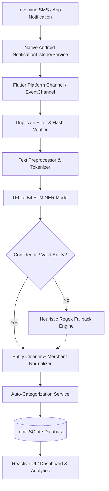

# 💳 Notitrack (BrokeTrack) — AI-Powered SMS Expense Tracker

<div align="center">

[](https://flutter.dev)
[](https://dart.dev)
[](https://www.tensorflow.org/lite)
[](https://www.android.com)
[](#-privacy--security-first)
[](LICENSE)

<p align="center">
  <b>Smart, automated, privacy-first personal expense tracking powered by on-device deep learning (BiLSTM NER) and native notification streams.</b>
</p>

[Key Features](#-key-features) •
[Architecture](#-system-architecture) •
[ML Pipeline](#-machine-learning--ner-pipeline) •
[Getting Started](#-getting-started) •
[Model Training](#-retraining-the-ml-model) •
[Project Structure](#-project-structure) •
[Contributing](#-contributing)

</div>

---

## 📖 Overview

**Notitrack** (also known as **BrokeTrack**) is an intelligent, offline-first personal finance management application for Android built with Flutter. Unlike traditional expense managers that require manual receipt typing or dangerous cloud banking credentials, Notitrack runs an on-device **BiLSTM Named Entity Recognition (NER)** neural network via **TensorFlow Lite**.

Whenever you make a transaction, Notitrack captures payment notifications and transactional SMS messages in real-time, extracts the **Amount**, **Merchant / Beneficiary**, and **Bank**, auto-assigns intelligent categories, and updates your budget analytics—**without a single byte of financial data ever leaving your phone.**

---

## ✨ Key Features

- 🤖 **On-Device Named Entity Recognition (NER)**: Custom Bidirectional LSTM model running locally with TFLite to detect entities (`Amount`, `Merchant`, `Bank`) with high contextual accuracy.
- ⚡ **Real-Time Notification & SMS Listener**: Background Android service captures incoming alerts from Google Pay, PhonePe, Paytm, BHIM UPI, and default SMS apps instantly.
- 🛡️ **Hybrid Robust Extraction**: Combines deep learning with a smart heuristic fallback engine and entity clean-up pipeline for 99%+ parsing resilience.
- 🔒 **100% Privacy & Offline-First**: Zero cloud dependencies, zero external analytics, zero tracking. All transactions reside strictly in local SQLite storage.
- 📊 **Rich Financial Insights**: Dynamic spending graphs, category breakdown, cashflow comparison (Income vs Expenses), and custom date-range filters powered by `fl_chart`.
- 🏷️ **Smart Categorization & Normalization**: Automatically classifies transactions into Food, Travel, Utilities, Groceries, Shopping, Entertainment, etc., while stripping out noise (e.g., UPI IDs, terminal codes).
- 🔄 **Duplicate Prevention Engine**: Hash-based deduplication window prevents duplicate records when multiple notifications fire for the same transaction.
- 📁 **Data Export & Backup**: Export transaction history to CSV and PDF or share summaries directly.
- 🎨 **Modern Material 3 Design**: Smooth animations, haptic feedback, dark/light themes, swipe-to-delete/edit actions, and refined typography (Poppins & Inter).

---

## 🏗 System Architecture



### Supported Apps & SMS Gateways

Notitrack actively parses transaction notifications from:
- 🟢 **UPI Apps**: Google Pay (`com.google.android.apps.nbu.paisa.user`), PhonePe (`com.phonepe.app`), Paytm (`net.one97.paytm`)
- 💬 **SMS Messengers**: Google Messages, Samsung Messages, Default Android AOSP Messaging
- 🏦 **Banks**: HDFC, SBI, ICICI, Axis, Kotak, PNB, Bank of Baroda, Canara, IDFC FIRST, IndusInd, and more.

---

## 🧠 Machine Learning & NER Pipeline

### 1. Model Architecture
- **Input Representation**: Text sequence tokenized and padded to fixed length ($L = 75$ tokens).
- **Embedding Layer**: Dense word embeddings capturing semantic contexts of financial vocabularies.
- **Bidirectional LSTM**: Captures bidirectional contextual dependencies before and after monetary figures and merchant names.
- **Dense Softmax / Tag Decoder**: Classifies each token into BIO tagging schemes:
  - `B-AMT`, `I-AMT` (Transaction Amount)
  - `B-MER`, `I-MER` (Merchant / Receiver)
  - `B-BNK`, `I-BNK` (Bank Name / Account source)
  - `O` (Outside / Irrelevant text)

### 2. Post-Processing & Normalization
Predictions pass through an `EntityCleaner` pipeline that:
- Cleans currency symbols (`₹`, `INR`, `Rs.`, `USD`).
- Resolves UPI handles (e.g., `merchant@okaxis` $\rightarrow$ `Merchant`).
- Removes reference IDs, VPA strings, and transaction trailing numbers.
- Resolves abbreviations to standardized bank entities.

---

## 🚀 Getting Started

### Prerequisites

Ensure you have the following installed on your development machine:
- [Flutter SDK](https://docs.flutter.dev/get-started/install) (`^3.9.0` or later)
- [Dart SDK](https://dart.dev/get-dart) (`^3.9.2`)
- [Android Studio](https://developer.android.com/studio) / Android SDK (API 26+)
- A physical Android device or Emulator (Notification Listener requires Android API 26+)

### Installation

1. **Clone the Repository**
   ```bash
   git clone https://github.com/callmeharsh0/BrokeTrack.git
   cd BrokeTrack
   ```

2. **Install Flutter Dependencies**
   ```bash
   flutter pub get
   ```

3. **Verify Connected Device**
   ```bash
   flutter devices
   ```

4. **Run the Application**
   ```bash
   flutter run
   ```

### 📱 Android Permission Setup

For automatic transaction detection to function:
1. Open the app on your Android device.
2. Grant **Notification Access / Listener Permission** when prompted (or go to `Settings > Apps > Special App Access > Notification Access > Notitrack`).
3. (Optional for historical SMS sync) Grant **SMS Read Permission**.

---

## 📂 Project Structure

```
├── android/                    # Android native host project & NotificationListenerService
├── assets/
│   ├── sms_ner_csv_labels.tflite   # Quantized TFLite NER Model
│   ├── word_tokenizer_csv.json     # Word-to-index vocabulary mapping
│   └── tag_tokenizer_csv.json      # Index-to-tag BIO mapping
├── fonts/                      # Poppins & Inter typography assets
├── lib/
│   ├── main.dart               # App entry point, dashboard, navigation, stream listeners
│   ├── ml_service.dart         # TFLite inference, tokenizer integration, fallback engine
│   ├── database_helper.dart    # SQLite CRUD operations & aggregate queries
│   ├── expense_model.dart      # Expense entity model & serialization
│   ├── models/                 # Category models & filter states
│   ├── screens/                # Settings, detailed analytics, category manager
│   ├── utils/                  # Theme configurations, haptic feedback, entity cleaners
│   └── widgets/                # Custom charts, transaction cards, stat cards
├── Model_trainer/              # Python deep learning training scripts
│   ├── train_bilstm_ner.py     # BiLSTM model training script (TensorFlow/Keras)
│   ├── convert_to_tflite.py    # Keras (.h5) to TFLite converter with quantization
│   ├── analyze_data.py         # Dataset analysis & token distribution
│   └── test_bilstm_model.py    # Test evaluation benchmarks
└── pubspec.yaml                # Flutter project configuration & dependencies
```

---

## 🔬 Retraining the ML Model

If you wish to train the NER model on custom bank SMS templates or international currencies:

1. **Navigate to the Model Trainer Directory**
   ```bash
   cd Model_trainer
   ```

2. **Install Python Requirements**
   ```bash
   pip install -r ../requirements_bilstm.txt
   ```

3. **Train the BiLSTM Model**
   ```bash
   python train_bilstm_ner.py
   ```

4. **Convert & Quantize to TFLite**
   ```bash
   python convert_to_tflite.py
   ```

5. **Deploy to Flutter Assets**
   Copy the generated `.tflite` model and `.json` tokenizer files to the `assets/` folder in the Flutter project root.

---

## 🔒 Privacy & Security First

- **Zero Cloud Uploads**: Your financial history, account balances, and SMS contents are processed purely on your device's CPU/NPU.
- **No Account Needed**: No email registration, no phone number verification, no third-party telemetry.
- **Local Storage**: All records are saved in an encrypted-at-rest SQLite database inside your app's sandboxed storage.

---

## 🛠 Tech Stack

- **UI & Framework**: [Flutter](https://flutter.dev), [Dart](https://dart.dev)
- **Machine Learning**: [TensorFlow Lite](https://www.tensorflow.org/lite), [tflite_flutter](https://pub.dev/packages/tflite_flutter)
- **Database**: [SQLite](https://sqlite.org) via [sqflite](https://pub.dev/packages/sqflite)
- **Visualization**: [fl_chart](https://pub.dev/packages/fl_chart)
- **UI Components**: [flutter_slidable](https://pub.dev/packages/flutter_slidable), [shimmer](https://pub.dev/packages/shimmer), [google_fonts](https://pub.dev/packages/google_fonts)
- **Document Generation**: [pdf](https://pub.dev/packages/pdf), [csv](https://pub.dev/packages/csv), [share_plus](https://pub.dev/packages/share_plus)

---

## 🤝 Contributing

Contributions, issues, and feature requests are welcome!
Feel free to check the [issues page](https://github.com/callmeharsh0/BrokeTrack/issues).

1. Fork the Project
2. Create your Feature Branch (`git checkout -b feature/AmazingFeature`)
3. Commit your Changes (`git commit -m 'Add some AmazingFeature'`)
4. Push to the Branch (`git push origin feature/AmazingFeature`)
5. Open a Pull Request

---

## 📄 License

Distributed under the MIT License. See `LICENSE` for more information.

---

<div align="center">
  <sub>Built with ❤️ for privacy-conscious personal finance tracking.</sub>
</div>
